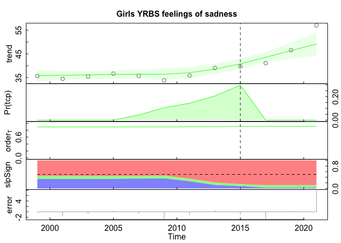
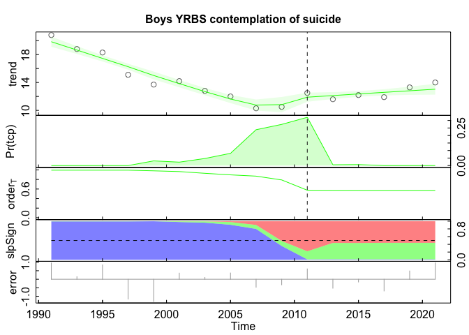

Analysis of YRBS and Wonder data
================

First, let’s read in the data.

``` r
teen <- read.csv("TeensmentalhealthdataandtechuseSheet6.csv", header=T)
wonder <- range_read("https://docs.google.com/spreadsheets/d/1eo2uoSubor1MqxRqVLyrXL1Z2OvRHNBY9piUKkddpco/edit#gid=1430897216",
                     sheet = "teen suicides") %>%
  select(1:4)
stack <- range_read("https://docs.google.com/spreadsheets/d/1eo2uoSubor1MqxRqVLyrXL1Z2OvRHNBY9piUKkddpco/edit#gid=1430897216",
                    sheet = "Stack-YRBS-Wonder-R") %>%
  select(1:10)
```

Now let’s clean the data and make some filetypes. The code below lists
all of the variables. Please take note.

``` r
wonder_tot_ts <- ts(wonder$`Total suicide rate`, start = 1968, frequency = 1)
wonder_grl <- ts(wonder$`Girls suicide rate`, start = 1968, frequency = 1)
wonder_boy <- ts(wonder$`Boys suicide rate`, start = 1968, frequency = 1)
YRBS_sad_tot_ts <- ts(na.omit(stack$`Felt sad or hopeless (YRBS)`),
                      start = 1999, frequency = .5)
YRBS_sad_grl_ts <- ts(na.omit(stack$`Female felt sad or hopeless`),
                      start = 1999, frequency = .5)
YRBS_sad_boy_ts <- ts(na.omit(stack$`Male felt sad or hopeless`),
                      start = 1999, frequency = .5)
YRBS_con_tot_ts <- ts(na.omit(stack$`Seriously considered attempting suicide (YRBS)`),
                      start = 1991, frequency = .5)
YRBS_con_grl_ts <- ts(na.omit(stack$`Female seriously considered attempting suicide (YRBS)`),
                      start = 1991, frequency = .5)
YRBS_con_boy_ts <- ts(na.omit(stack$`Male seriously considered attempting suicide`),
                      start = 1991, frequency = .5)
```

The nine time series are plotted below using tsdisplay(). They are

- Total suicide rate (Wonder)

- Girls suicide rate (Wonder)

- Boys suicide rate (Wdoner)

- Total felt sad or hopeless (YRBS)

- Female felt sad or hopeless (YRBS)

- Male felt sad or hopeless (YRBS)

- Seriously considered attempting suicide (YRBS)

- Female seriously considered attempting suicide (YRBS)

- Male seriously considered attempting suicide (YRBS)

What I like about this function is that is plots the data and calculates
the ACFs and PACFs.

Autocorrelation Function (ACF) and Partial Autocorrelation Function
(PACF) are commonly used correlation estimates in time series analysis.
Autocorrelation is the correlation between a time series with a lagged
version of itself.

PACF is a partial auto-correlation function. It finds the correlation of
the residuals instead of the lags. It is what remains after “removing
the effects which are already explained by the earlier lag(s) with the
next lag value hence ‘partial’ and not ‘complete.’

In a follow up post, I will come back to ACFs and PACFs, but for now,
take a look.

<!-- --><!-- --><!-- --><!-- --><!-- --><!-- --><!-- --><!-- --><!-- -->

The next nine graphs are outputs from the Rbeast library. Rbeast is an
implementation of the BEAST estimator, first described in Zhao et al.
(2019). [Zhao’s Github](https://github.com/zhaokg/Rbeast) has all of the
supporting documentation. As the paper notes, the estimator assumes the
data is a time series made of three components, which includes
seasonality, trend, and abrupt changes, in addition to noise.

The key is the trend:

> The trend T(t) is modeled as a piecewise linear function with respect
> to m knots at τj, j = 1,…m (Fig. 3), which divide the time span into
> (m + 1) intervals \[τj, τj+1\], j = 0,…,m, with τ0 = t0 and τm+1 = tn
> being the start and end of the time series. The trend changepoints τj
> are not necessarily the same as the seasonal changepoints ξk. The
> trend over each interval simply is a line segment (Fig. 3), defined by
> coefficients aj and bj

Altogether, BEAST gives us a Bayesian estimated piecewise linear
function.

The plotted outputs provide an interesting metric, `Pr(tcp)`. This plots
the probability of having a changepoint over time (along x), with the
peaks giving the most likely locations of sudden change. In other words,
these are rough estimates of when the trends changed.

<!-- --><!-- --><!-- --><!-- --><!-- --><!-- --><!-- --><!-- --><!-- -->
