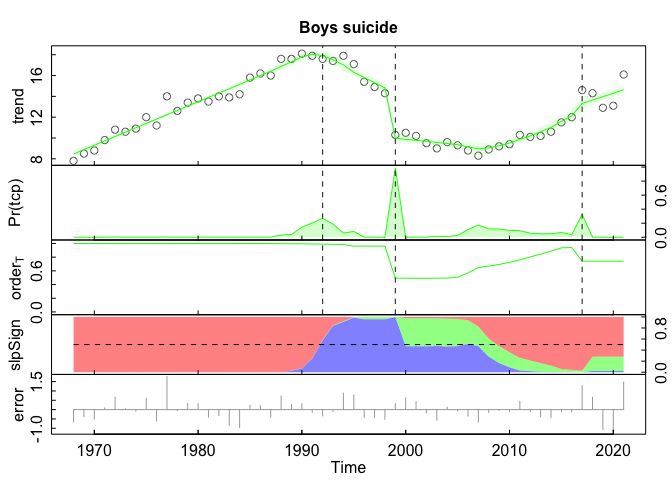

Analysis of YRBS and Wonder data
================

Read in the data.

Clean the data and make some filetypes.

``` r
wonder_tot_ts <- ts(wonder$`Total suicide rate`, start = 1968, frequency = 1)
wonder_grl <- ts(wonder$`Girls suicide rate`, start = 1968, frequency = 1)
wonder_boy <- ts(wonder$`Boys suicide rate`, start = 1968, frequency = 1)
YRBS_sad_tot_ts <- ts(na.omit(stack$`Felt sad or hopeless (YRBS)`),
                      start = 1999, frequency = .5)
YRBS_sad_grl_ts <- ts(na.omit(stack$`Female felt sad or hopeless`),
                      start = 1999, frequency = .5)
YRBS_sad_boy_ts <- ts(na.omit(stack$`Male felt sad or hopeless`),
                      start = 1999, frequency = .5)
YRBS_con_tot_ts <- ts(na.omit(stack$`Seriously considered attempting suicide (YRBS)`),
                      start = 1991, frequency = .5)
YRBS_con_grl_ts <- ts(na.omit(stack$`Female seriously considered attempting suicide (YRBS)`),
                      start = 1991, frequency = .5)
YRBS_con_boy_ts <- ts(na.omit(stack$`Male seriously considered attempting suicide`),
                      start = 1991, frequency = .5)
```

Let’s plot what we have so far.

<!-- --><!-- --><!-- -->

What about the girls?

<!-- --><!-- --><!-- -->

What about the boys?

<!-- --><!-- --><!-- -->

<!-- --><!-- --><!-- -->

``` r
out1 <- beast(wonder_boy, season='none')
out2 <- beast(YRBS_sad_boy_ts, season='none')
out3 <- beast(YRBS_con_boy_ts, season='none')

plot(out1, main = "Boys suicide")
```

<!-- -->

``` r
plot(out2, main = "Boys YRBS feelings of sadness")
```

<!-- -->

``` r
plot(out3, main = "Boys YRBS contemplation of suicide")
```

<!-- -->
<!-- --><!-- --><!-- -->
