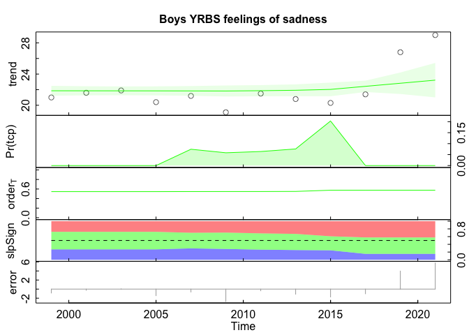

Analysis of YRBS and Wonder data
================

Read in the data.

Clean the data and make some filetypes.

Let’s plot what we have so far.

<!-- --><!-- --><!-- -->

What about the girls?

<!-- --><!-- --><!-- -->

What about the boys?

<!-- --><!-- --><!-- -->

<!-- --><!-- --><!-- -->

<!-- --><!-- --><!-- -->
<!-- --><!-- --><!-- -->
